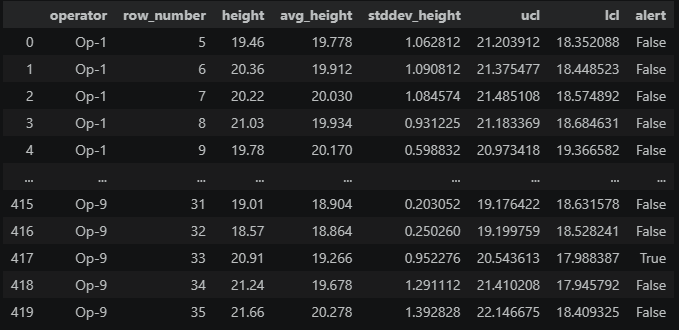

# Manufacturing Quality Monitoring: Statistical Process Control (SPC) Alert System


## 📌 Executive Summary
A discrete manufacturing facility required a data-driven quality surveillance system to monitor machining consistency across operating units. Rather than adjusting machinery based on sporadic variances, the engineering team implemented **Statistical Process Control (SPC)** to detect true operational anomalies while avoiding over-calibration.

Using advanced PostgreSQL window framing and multi-layered subqueries, this project calculates moving control thresholds—**Upper Control Limit (UCL)** and **Lower Control Limit (LCL)**—across rolling 5-part batches partitioned by operator. The resulting pipeline generates a dynamic boolean alert flag (`alert`) whenever a component's height breaches acceptable statistical bounds.

---

## 📂 Data Schema
The analysis was performed on the `manufacturing_parts` production table containing inspection and operational telemetry:

* **`item_no`**: Sequential component serial tracking identifier (`INT`).
* **`length`**: Measured longitudinal dimension of the fabricated item (`FLOAT`).
* **`width`**: Measured cross-sectional lateral dimension (`FLOAT`).
* **`height`**: Measured vertical dimension subject to tolerance testing (`FLOAT`).
* **`operator`**: Operating machine or line workstation identifier (e.g., `Op-1` through `Op-20`) (`VARCHAR`).

---

## 🛠️ Technical Implementation & SQL Concepts
The solution utilizes statistical formulations and window constructs to monitor moving manufacturing tolerances:

* **Named Window Specification (`WINDOW w AS ...`)**: Defined a reusable window frame partitioned by `operator`, ordered sequentially by `item_no`, and bounded to a 5-unit moving span (`ROWS BETWEEN 4 PRECEDING AND CURRENT ROW`).
* **Sliding Statistical Aggregations**: Computed dynamic moving baselines for `AVG(height)` and `STDDEV(height)` across the 5-sample batch.
* **Control Limit Formulas**: Implemented standard 3-sigma process capability boundaries:
  
  $$UCL = \text{avg} + 3 \times \frac{\text{stddev}}{\sqrt{5}}$$
  
  $$LCL = \text{avg} - 3 \times \frac{\text{stddev}}{\sqrt{5}}$$
* **Boundary Filtering & Alert Flagging**: Excluded incomplete initiation windows (`row_number >= 5`) and applied a conditional `CASE WHEN` statement evaluating whether height falls strictly within `[LCL, UCL]`.

```sql
SELECT
    control_limits.*,
    CASE
        WHEN control_limits.height NOT BETWEEN control_limits.lcl AND control_limits.ucl
        THEN TRUE
        ELSE FALSE
    END AS alert
FROM (
    SELECT
        stats.*, 
        stats.avg_height + 3 * stats.stddev_height / SQRT(5) AS ucl, 
        stats.avg_height - 3 * stats.stddev_height / SQRT(5) AS lcl  
    FROM (
        SELECT 
            operator,
            ROW_NUMBER() OVER w AS row_number, 
            height, 
            AVG(height) OVER w AS avg_height, 
            STDDEV(height) OVER w AS stddev_height
        FROM manufacturing_parts 
        WINDOW w AS (
            PARTITION BY operator 
            ORDER BY item_no 
            ROWS BETWEEN 4 PRECEDING AND CURRENT ROW
        )
    ) AS stats
    WHERE stats.row_number >= 5
) AS control_limits;
```

---

## 📊 Query Output



*Figure 1: Query Output — Moving Control Limits (UCL/LCL) and SPC Alert Flags across Evaluated Batches.*

---

## 🔍 Key Strategic Insights
1. **Automated Defect Isolation**: Evaluated across 420 qualifying production parts, identifying critical non-conformance events (e.g., Row 417 under `Op-9`, where an observed height of **20.91** breached the upper threshold of **20.54**, raising an alert).
2. **Operator Variance Benchmarking**: Partitioning by machine/operator revealed that variance stability differs across stations, allowing maintenance teams to service degrading tools before full line shutdowns occur.
3. **Operational Impact**: Eliminating manual boundary calculation enables near real-time automated alerting, reducing scrap rates and ensuring tight manufacturing compliance.

---
*© 2026 Ryan Tang.*
